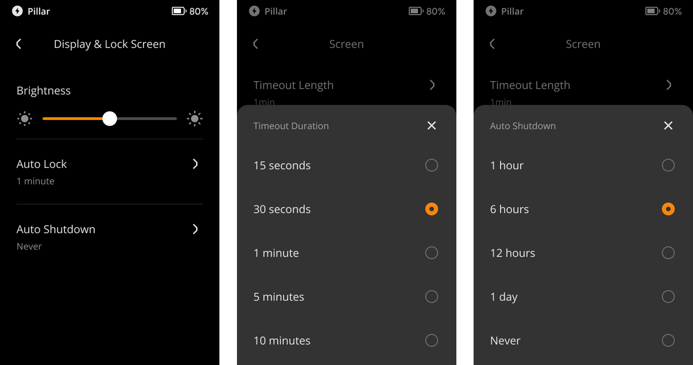

:::tip

要点总结**:**
- 您可以根据本篇教程开启或关闭设备的振动反应。

- Keystone 3 Pro支持您对设备的亮度，自动锁屏时间及自动关机时间进行设置。

:::

## 步骤: {#c3f4e83f9d0e4930ba2db3fc22a2f29e}

### 振动 {#9c4d3743123946a09506a7db0e241da0}

- 点击屏幕右上角的 [···]  &gt; [Device Settings] &gt; [System Settings] &gt; [Vibration].

  

### 屏幕设置 {#d588dac678eb4ad2b8717b5df469a5ab}

1. 点击屏幕右上角的 [···] 标志 &gt; [Device Settings] &gt; [System Settings] &gt; [Display & Lock Screen].

  

1. 您可以根据喜好设置屏幕的亮度，自动锁屏时间及自动关机时间。

  

