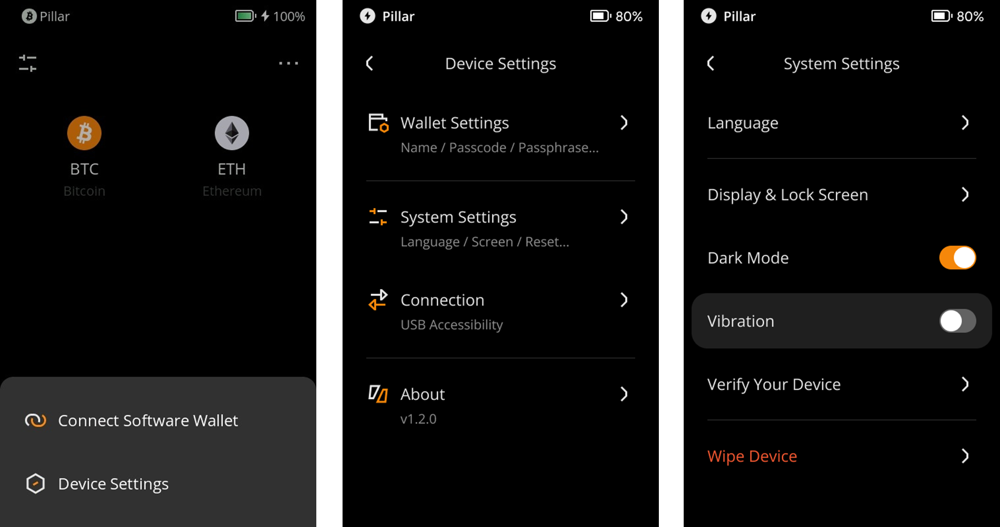
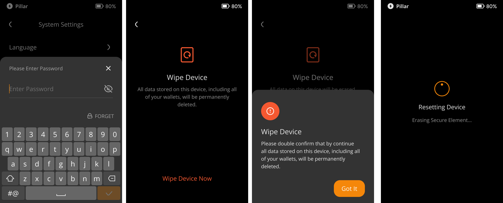

:::tip

要点总结**:**
- 您可以根据这篇教程清除数据，恢复出厂设置。

- 恢复出厂设置后，固件版本不会恢复至出厂版本。

- 要恢复出厂设置，设备需要至少有20%的电量。

:::

## 步骤: {#e713dcc1059743709389b67e9e943dda}

1. 点击主界面右上角的 [···]  &gt; [Device Settings] &gt; [System Settings] &gt; [Wipe Device].

  

1. 输入密码，并按照指示恢复出厂设置。

  

